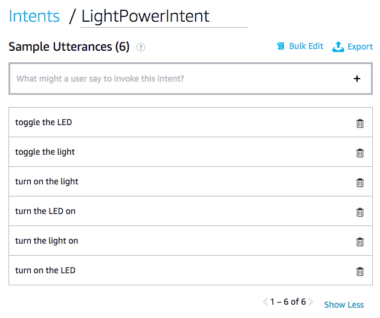

# Chapter 3: Talking to Particle from Alexa

| **Project Goal**            | Control your particle device from your Alexa skill.                                                                                                                       |
| --------------------------- | ------------------------------------------------------------------------------------------------------------------------------------------------------------------------- |
| **What you’ll learn**       | Building advanced voice interfaces, how to make HTTPS calls |
| **Tools you’ll need**       | Access to the internet for developer.amazon.com and build.particle.io                                                                                                            |
| **Time needed to complete** | 60 minutes                                           |

This lab will require you to open several tabs in your browser.  It is highly recommended that you open all pages in a new tab, since we will be referring back to each of them frequently.

## Open the Alexa Developer Console.

1. Visit the [Alexa Developer Console](https://developer.amazon.com/alexa/console/ask) and log in.

## Add a new intent called "LightPowerIntent".

1. On the "Build" tab of the Alexa Developer Console, in the left navigation, click the "Add" button next to Intents.

2. Type "LightPowerIntent" into the "Create custom intent" textbox, and then click the "Create custom intent" button.

3. Now we need to provide a list of sample utterances for our intent that represent what a user might say to make this happen.  Here's a short sample list to start with, but you can add more to meet your needs.  Type or copy each value into the textbox, and press Enter to add it to the list.

* turn on the LED
* turn the light on
* turn the LED on
* turn on the light
* toggle the light
* toggle the LED

Your list should look like the one below.

You'll notice that we only provide the "on" states for these sample utterances.  We are actually going to create a SLOT to handle the on/off values for these utterances next.

4. Highlight the word "on" in one of your sample utterances.

5. Change the value in the textbox to "OnOff" and click the "Add" button.

6. For each of the other "on" values in our sample utterances, highlight the word, and select our new slot from the existing list.

7. You should now see "OnOff" listed in your "Intent Slots" section at the bottom of the page.

This slot does not currently have a slot type selected, and we need to create one that can handle the values "on" and "off".

8. In the left navigation, click the "Add" button next to Slot Types.

9. Create a new custom slot type named "OnOffType", and click the "Create custom slot type" button.

10. This slot type will only have two possible values: "on" and "off".  Add them to the list of slot values.

11. In the left navigation, find your "OnOff" slot that is under your LightPowerIntent, and click on it.

12. In the "Slot Type" dropdown, select our new "OnOffType" slot type.

13. Build your model by clicking the "Build Model" button at the top of the screen.

14. We can quickly test our sample utterances using the Evaluate Model tool.  Click "Evaluate Model" at the top right of the screen.

15. In the "Utterance Profiler" tab, type an expected user utterance, like "turn on the light".

## GET YOUR PARTICLE TOKEN AND DEVICEID

## MODIFY TOGGLELED TO TURN LIGHT ON OR OFF.

## ADD INTENTS FOR SETTING COLOR

## MODIFY TOGGLELED FUNCTION ON PARTICLE TO HANDLE NEW REQUESTS

## ADD INTENTS FOR REQUESTING TEMPERATURE AND HUMIDITY

## CREATE NEW PARTICLE FUNCTION FOR HANDLING REQUESTS FOR TEMP AND HUMIDITY.

**And if you want to take your exploration further, click the "Extra" link below!**

**BEFORE YOU GO** we'd love it if you could provide feedback on this workshop. Please visit [this link](https://particleiot.typeform.com/to/JiF8xM) to rate your experience.
